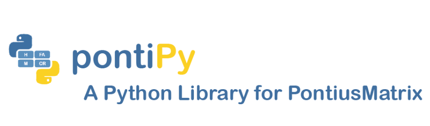

<font size="10" color='#FFCD3F' face = 'Arial Rounded MT'>Priyanka Verma, Priscilla Ahn</font>


<center> <font size="18" color='#538EBB' face = 'Arial Rounded MT'>Temporal Difference Plot</font>


Install pontiPy from TestPyPi Server through pip


```python
!pip install -i https://test.pypi.org/simple/ pontiPy==2.4
```

    Looking in indexes: https://test.pypi.org/simple/
    Requirement already satisfied: pontiPy==2.4 in c:\users\prverma\anaconda3\lib\site-packages (2.4)
    Requirement already satisfied: plotly-express in c:\users\prverma\anaconda3\lib\site-packages (from pontiPy==2.4) (0.4.1)
    Requirement already satisfied: pandas in c:\users\prverma\anaconda3\lib\site-packages (from pontiPy==2.4) (1.0.5)
    Requirement already satisfied: patsy>=0.5 in c:\users\prverma\anaconda3\lib\site-packages (from plotly-express->pontiPy==2.4) (0.5.1)
    Requirement already satisfied: scipy>=0.18 in c:\users\prverma\anaconda3\lib\site-packages (from plotly-express->pontiPy==2.4) (1.5.0)
    Requirement already satisfied: numpy>=1.11 in c:\users\prverma\anaconda3\lib\site-packages (from plotly-express->pontiPy==2.4) (1.18.5)
    Requirement already satisfied: plotly>=4.1.0 in c:\users\prverma\anaconda3\lib\site-packages (from plotly-express->pontiPy==2.4) (4.10.0)
    Requirement already satisfied: statsmodels>=0.9.0 in c:\users\prverma\anaconda3\lib\site-packages (from plotly-express->pontiPy==2.4) (0.11.1)
    Requirement already satisfied: python-dateutil>=2.6.1 in c:\users\prverma\anaconda3\lib\site-packages (from pandas->pontiPy==2.4) (2.8.1)
    Requirement already satisfied: pytz>=2017.2 in c:\users\prverma\anaconda3\lib\site-packages (from pandas->pontiPy==2.4) (2020.1)
    Requirement already satisfied: six in c:\users\prverma\anaconda3\lib\site-packages (from patsy>=0.5->plotly-express->pontiPy==2.4) (1.15.0)
    Requirement already satisfied: retrying>=1.3.3 in c:\users\prverma\anaconda3\lib\site-packages (from plotly>=4.1.0->plotly-express->pontiPy==2.4) (1.3.3)
    

Import pontiPy


```python
from pontiPy import *
```

Dependencies


```python
import pandas as pd
import plotly.express as px
```

<center> <font size="18" color='#538EBB' face = 'Arial Rounded MT'>Confusion Matrix (1985-1986)</font>


```python
df = pd.read_csv(r'..\DATA\PRESENT\1985 a 1986.csv', index_col = 0)
```


```python
display(df)
```


<div>
<style scoped>
    .dataframe tbody tr th:only-of-type {
        vertical-align: middle;
    }

    .dataframe tbody tr th {
        vertical-align: top;
    }

    .dataframe thead th {
        text-align: right;
    }
</style>
<table border="1" class="dataframe">
  <thead>
    <tr style="text-align: right;">
      <th></th>
      <th>Forest</th>
      <th>Natural</th>
      <th>Agriculture</th>
      <th>NonVegetated</th>
      <th>Water</th>
      <th>NotObserved</th>
    </tr>
  </thead>
  <tbody>
    <tr>
      <th>Forest</th>
      <td>595909521</td>
      <td>202111</td>
      <td>1123311</td>
      <td>24087</td>
      <td>254515</td>
      <td>108</td>
    </tr>
    <tr>
      <th>Natural</th>
      <td>338378</td>
      <td>57102895</td>
      <td>171374</td>
      <td>21774</td>
      <td>180725</td>
      <td>128</td>
    </tr>
    <tr>
      <th>Agriculture</th>
      <td>1090229</td>
      <td>400869</td>
      <td>175958382</td>
      <td>116476</td>
      <td>38080</td>
      <td>74</td>
    </tr>
    <tr>
      <th>NonVegetated</th>
      <td>10149</td>
      <td>12805</td>
      <td>111343</td>
      <td>2789543</td>
      <td>7650</td>
      <td>209</td>
    </tr>
    <tr>
      <th>Water</th>
      <td>66613</td>
      <td>20937</td>
      <td>11085</td>
      <td>2131</td>
      <td>15216393</td>
      <td>65</td>
    </tr>
    <tr>
      <th>NotObserved</th>
      <td>126</td>
      <td>78</td>
      <td>86</td>
      <td>147</td>
      <td>603</td>
      <td>22370</td>
    </tr>
  </tbody>
</table>
</div>


<center> <font size="18" color='#FFCD3F' face = 'Arial Rounded MT'>pontiPy</font><font size="18" color='#538EBB' face = 'Arial Rounded MT'> Usage</font>


```python
matrix_85_86 = pontiPy_Change(df)
```

<font size="5" color='#538EBB' face = 'Arial Rounded MT'>Matrix</font>


```python
matrix_85_86.matrix()
```


<div>
<style scoped>
    .dataframe tbody tr th:only-of-type {
        vertical-align: middle;
    }

    .dataframe tbody tr th {
        vertical-align: top;
    }

    .dataframe thead th {
        text-align: right;
    }
</style>
<table border="1" class="dataframe">
  <thead>
    <tr style="text-align: right;">
      <th></th>
      <th>Forest</th>
      <th>Natural</th>
      <th>Agriculture</th>
      <th>NonVegetated</th>
      <th>Water</th>
      <th>NotObserved</th>
      <th>Sum</th>
      <th>Loss</th>
    </tr>
  </thead>
  <tbody>
    <tr>
      <th>Forest</th>
      <td>595909521</td>
      <td>202111</td>
      <td>1123311</td>
      <td>24087</td>
      <td>254515</td>
      <td>108</td>
      <td>597513653</td>
      <td>1604132</td>
    </tr>
    <tr>
      <th>Natural</th>
      <td>338378</td>
      <td>57102895</td>
      <td>171374</td>
      <td>21774</td>
      <td>180725</td>
      <td>128</td>
      <td>57815274</td>
      <td>712379</td>
    </tr>
    <tr>
      <th>Agriculture</th>
      <td>1090229</td>
      <td>400869</td>
      <td>175958382</td>
      <td>116476</td>
      <td>38080</td>
      <td>74</td>
      <td>177604110</td>
      <td>1645728</td>
    </tr>
    <tr>
      <th>NonVegetated</th>
      <td>10149</td>
      <td>12805</td>
      <td>111343</td>
      <td>2789543</td>
      <td>7650</td>
      <td>209</td>
      <td>2931699</td>
      <td>142156</td>
    </tr>
    <tr>
      <th>Water</th>
      <td>66613</td>
      <td>20937</td>
      <td>11085</td>
      <td>2131</td>
      <td>15216393</td>
      <td>65</td>
      <td>15317224</td>
      <td>100831</td>
    </tr>
    <tr>
      <th>NotObserved</th>
      <td>126</td>
      <td>78</td>
      <td>86</td>
      <td>147</td>
      <td>603</td>
      <td>22370</td>
      <td>23410</td>
      <td>1040</td>
    </tr>
    <tr>
      <th>Sum</th>
      <td>597415016</td>
      <td>57739695</td>
      <td>177375581</td>
      <td>2954158</td>
      <td>15697966</td>
      <td>22954</td>
      <td>851205370</td>
      <td>4206266</td>
    </tr>
    <tr>
      <th>Gain</th>
      <td>1505495</td>
      <td>636800</td>
      <td>1417199</td>
      <td>164615</td>
      <td>481573</td>
      <td>584</td>
      <td>4206266</td>
      <td></td>
    </tr>
  </tbody>
</table>
</div>


<font size="5" color='#538EBB' face = 'Arial Rounded MT'>Metrics</font>


```python
print('Total Quantity Disagreement:', matrix_85_86.quantity(), 'Hectares')
print('Total Exchange Disagreement:', matrix_85_86.exchange(), 'Hectares')
print('Total Shift Disagreement:', matrix_85_86.shift(), 'Hectares')
```

    Total Quantity Disagreement: 403201 Hectares
    Total Exchange Disagreement: 3398498 Hectares
    Total Shift Disagreement: 2103816.0 Hectares
    

<center> <font size="18" color='#538EBB' face = 'Arial Rounded MT'>Workflow</font>

#### Matrix Extraction

Matrices retrieved from MapBioMas Website for 1985-2019

---

#### Calculate Metrics

Calculate metrics for each yearly interval

---

#### Plot

Compile everything into a stacked bar chart 

---

<center> <font size="18" color='#538EBB' face = 'Arial Rounded MT'>Matrix Extraction</font>


```python

```

<center> <font size="18" color='#538EBB' face = 'Arial Rounded MT'>Calculate Metrics</font>

#### Quantity


```python
matrix_85_86.quantity()
```


    403201


#### Exchange


```python
matrix_85_86.exchange()
```


    3398498


#### Shift


```python
matrix_85_86.shift()
```


    2103816.0


```python
from IPython.display import HTML
import random

def hide_toggle(for_next=False):
    this_cell = """$('div.cell.code_cell.rendered.selected')"""
    next_cell = this_cell + '.next()'

    toggle_text = 'See Code'  # text shown on toggle link
    target_cell = this_cell  # target cell to control with toggle
    js_hide_current = ''  # bit of JS to permanently hide code in current cell (only when toggling next cell)

    if for_next:
        target_cell = next_cell
        toggle_text += ' next cell'
        js_hide_current = this_cell + '.find("div.input").hide();'

    js_f_name = 'code_toggle_{}'.format(str(random.randint(1,2**64)))

    html = """
        <script>
            function {f_name}() {{
                {cell_selector}.find('div.input').toggle();
            }}

            {js_hide_current}
        </script>

        <a href="javascript:{f_name}()">{toggle_text}</a>
    """.format(
        f_name=js_f_name,
        cell_selector=target_cell,
        js_hide_current=js_hide_current, 
        toggle_text=toggle_text
    )

    return HTML(html)
```


```python
colors = ['#769BA9', '#94C197', '#D7D779', '#8FC0D0']
```

<center> <font size="18" color='#538EBB' face = 'Arial Rounded MT'>Plot</font>


```python
long_df = pd.read_csv(r'..\DATA\QSE_Year.csv')

fig = px.bar(long_df, x="Year", y=["Quantity", "Exchange", "Shift"], 
             title="<b>Yearly Temporal Difference (1985-2019)<b>",
             color_discrete_sequence=colors,
             template="simple_white",  hover_name="Year")

layout = fig.update_layout(
    font=dict(family="Trebuchet MS", size=12),
    hovermode=False,
    yaxis=dict(title='Area',
               title_font=dict(size=12, family='Trebuchet MS', color='black')),
    xaxis=dict(title='Year', dtick=1,
               title_font=dict(size=12, family='Trebuchet MS', color='black')),
    legend=dict(orientation="h", yanchor="bottom", y=1.02, xanchor="right",
                x=0.65, title='',
                font=dict(family="Trebuchet MS", size=12)),
    title =  dict(font =dict(family='"Trebuchet MS',
                             size = 20,
                               color = '#D58E4D')),
    title_x=0.5
    
)

fig.show()
hide_toggle()
```


<div>                            <div id="65b5d399-2c29-42da-ab30-5cf9e9fa87a9" class="plotly-graph-div" style="height:525px; width:100%;"></div>            <script type="text/javascript">                require(["plotly"], function(Plotly) {                    window.PLOTLYENV=window.PLOTLYENV || {};                                    if (document.getElementById("65b5d399-2c29-42da-ab30-5cf9e9fa87a9")) {                    Plotly.newPlot(                        "65b5d399-2c29-42da-ab30-5cf9e9fa87a9",                        [{"alignmentgroup": "True", "hovertemplate": "<b>%{hovertext}</b><br><br>variable=Quantity<br>Year=%{x}<br>value=%{y}<extra></extra>", "hovertext": ["1985 to 1986", "1986 to 1987", "1987 to 1988", "1988 to 1989", "1989 to 1990", "1990 to 1991", "1991 to 1992", "1992 to 1993", "1993 to 1994", "1994 to 1995", "1995 to 1996", "1996 to 1997", "1997 to 1998", "1998 to 1999", "1999 to 2000", "2000 to 2001", "2001 to 2002", "2002 to 2003", "2003 to 2004", "2004 to 2005", "2005 to 2006", "2006 to 2007", "2007 to 2008", "2008 to 2009", "2009 to 2010", "2010 to 2011", "2011 to 2012", "2012 to 2013", "2013 to 2014", "2014 to 2015", "2015 to 2016", "2016 to 2017", "2017 to 2018", "2018 to 2019"], "legendgroup": "Quantity", "marker": {"color": "#769BA9"}, "name": "Quantity", "offsetgroup": "Quantity", "orientation": "v", "showlegend": true, "textposition": "auto", "type": "bar", "x": ["1985 to 1986", "1986 to 1987", "1987 to 1988", "1988 to 1989", "1989 to 1990", "1990 to 1991", "1991 to 1992", "1992 to 1993", "1993 to 1994", "1994 to 1995", "1995 to 1996", "1996 to 1997", "1997 to 1998", "1998 to 1999", "1999 to 2000", "2000 to 2001", "2001 to 2002", "2002 to 2003", "2003 to 2004", "2004 to 2005", "2005 to 2006", "2006 to 2007", "2007 to 2008", "2008 to 2009", "2009 to 2010", "2010 to 2011", "2011 to 2012", "2012 to 2013", "2013 to 2014", "2014 to 2015", "2015 to 2016", "2016 to 2017", "2017 to 2018", "2018 to 2019"], "xaxis": "x", "y": [403201.0, 2716500.0, 3383548.0, 2656434.0, 1636845.0, 2117526.0, 2668832.0, 2905477.0, 2489336.0, 2801365.0, 2927958.0, 2795909.0, 2454540.0, 2990842.0, 2577024.0, 2147976.0, 3533662.0, 4078374.0, 3296743.0, 2547656.0, 2086588.0, 1622294.0, 1490870.0, 827401.0, 781394.0, 931657.0, 940847.0, 1196013.0, 1492532.0, 1386855.0, 1711373.0, 1110983.0, 1611211.0, 1662837.0], "yaxis": "y"}, {"alignmentgroup": "True", "hovertemplate": "<b>%{hovertext}</b><br><br>variable=Exchange<br>Year=%{x}<br>value=%{y}<extra></extra>", "hovertext": ["1985 to 1986", "1986 to 1987", "1987 to 1988", "1988 to 1989", "1989 to 1990", "1990 to 1991", "1991 to 1992", "1992 to 1993", "1993 to 1994", "1994 to 1995", "1995 to 1996", "1996 to 1997", "1997 to 1998", "1998 to 1999", "1999 to 2000", "2000 to 2001", "2001 to 2002", "2002 to 2003", "2003 to 2004", "2004 to 2005", "2005 to 2006", "2006 to 2007", "2007 to 2008", "2008 to 2009", "2009 to 2010", "2010 to 2011", "2011 to 2012", "2012 to 2013", "2013 to 2014", "2014 to 2015", "2015 to 2016", "2016 to 2017", "2017 to 2018", "2018 to 2019"], "legendgroup": "Exchange", "marker": {"color": "#94C197"}, "name": "Exchange", "offsetgroup": "Exchange", "orientation": "v", "showlegend": true, "textposition": "auto", "type": "bar", "x": ["1985 to 1986", "1986 to 1987", "1987 to 1988", "1988 to 1989", "1989 to 1990", "1990 to 1991", "1991 to 1992", "1992 to 1993", "1993 to 1994", "1994 to 1995", "1995 to 1996", "1996 to 1997", "1997 to 1998", "1998 to 1999", "1999 to 2000", "2000 to 2001", "2001 to 2002", "2002 to 2003", "2003 to 2004", "2004 to 2005", "2005 to 2006", "2006 to 2007", "2007 to 2008", "2008 to 2009", "2009 to 2010", "2010 to 2011", "2011 to 2012", "2012 to 2013", "2013 to 2014", "2014 to 2015", "2015 to 2016", "2016 to 2017", "2017 to 2018", "2018 to 2019"], "xaxis": "x", "y": [3398498.0, 4460526.0, 5179268.0, 6028560.0, 5998954.0, 4985850.0, 5304148.0, 4800250.0, 5499604.0, 5716622.0, 4785916.0, 5092612.0, 5468862.0, 4380266.0, 4832952.0, 5127378.0, 4872126.0, 5782278.0, 4530030.0, 4369822.0, 4516716.0, 4104272.0, 5000426.0, 4645672.0, 4708088.0, 5008160.0, 5538810.0, 5164030.0, 3852698.0, 3614744.0, 3823866.0, 4185858.0, 4364320.0, 4181326.0], "yaxis": "y"}, {"alignmentgroup": "True", "hovertemplate": "<b>%{hovertext}</b><br><br>variable=Shift<br>Year=%{x}<br>value=%{y}<extra></extra>", "hovertext": ["1985 to 1986", "1986 to 1987", "1987 to 1988", "1988 to 1989", "1989 to 1990", "1990 to 1991", "1991 to 1992", "1992 to 1993", "1993 to 1994", "1994 to 1995", "1995 to 1996", "1996 to 1997", "1997 to 1998", "1998 to 1999", "1999 to 2000", "2000 to 2001", "2001 to 2002", "2002 to 2003", "2003 to 2004", "2004 to 2005", "2005 to 2006", "2006 to 2007", "2007 to 2008", "2008 to 2009", "2009 to 2010", "2010 to 2011", "2011 to 2012", "2012 to 2013", "2013 to 2014", "2014 to 2015", "2015 to 2016", "2016 to 2017", "2017 to 2018", "2018 to 2019"], "legendgroup": "Shift", "marker": {"color": "#D7D779"}, "name": "Shift", "offsetgroup": "Shift", "orientation": "v", "showlegend": true, "textposition": "auto", "type": "bar", "x": ["1985 to 1986", "1986 to 1987", "1987 to 1988", "1988 to 1989", "1989 to 1990", "1990 to 1991", "1991 to 1992", "1992 to 1993", "1993 to 1994", "1994 to 1995", "1995 to 1996", "1996 to 1997", "1997 to 1998", "1998 to 1999", "1999 to 2000", "2000 to 2001", "2001 to 2002", "2002 to 2003", "2003 to 2004", "2004 to 2005", "2005 to 2006", "2006 to 2007", "2007 to 2008", "2008 to 2009", "2009 to 2010", "2010 to 2011", "2011 to 2012", "2012 to 2013", "2013 to 2014", "2014 to 2015", "2015 to 2016", "2016 to 2017", "2017 to 2018", "2018 to 2019"], "xaxis": "x", "y": [2103816.0, 2586458.0, 2837014.0, 3251935.0, 3209719.0, 2764189.0, 3083633.0, 2630032.0, 2946175.0, 3035087.0, 2500836.0, 2739139.0, 3013817.0, 2439731.0, 2601542.0, 2673581.0, 3077408.0, 2994855.0, 2491105.0, 2323274.0, 2324744.0, 2310859.0, 2556680.0, 2381461.0, 2689820.0, 2689324.0, 2930685.0, 2690036.0, 2013087.0, 1919763.0, 2114673.0, 2179773.0, 2375952.0, 2282908.0], "yaxis": "y"}],                        {"barmode": "relative", "font": {"family": "Trebuchet MS", "size": 12}, "hovermode": false, "legend": {"font": {"family": "Trebuchet MS", "size": 12}, "orientation": "h", "title": {"text": ""}, "tracegroupgap": 0, "x": 0.65, "xanchor": "right", "y": 1.02, "yanchor": "bottom"}, "template": {"data": {"bar": [{"error_x": {"color": "rgb(36,36,36)"}, "error_y": {"color": "rgb(36,36,36)"}, "marker": {"line": {"color": "white", "width": 0.5}}, "type": "bar"}], "barpolar": [{"marker": {"line": {"color": "white", "width": 0.5}}, "type": "barpolar"}], "carpet": [{"aaxis": {"endlinecolor": "rgb(36,36,36)", "gridcolor": "white", "linecolor": "white", "minorgridcolor": "white", "startlinecolor": "rgb(36,36,36)"}, "baxis": {"endlinecolor": "rgb(36,36,36)", "gridcolor": "white", "linecolor": "white", "minorgridcolor": "white", "startlinecolor": "rgb(36,36,36)"}, "type": "carpet"}], "choropleth": [{"colorbar": {"outlinewidth": 1, "tickcolor": "rgb(36,36,36)", "ticks": "outside"}, "type": "choropleth"}], "contour": [{"colorbar": {"outlinewidth": 1, "tickcolor": "rgb(36,36,36)", "ticks": "outside"}, "colorscale": [[0.0, "#440154"], [0.1111111111111111, "#482878"], [0.2222222222222222, "#3e4989"], [0.3333333333333333, "#31688e"], [0.4444444444444444, "#26828e"], [0.5555555555555556, "#1f9e89"], [0.6666666666666666, "#35b779"], [0.7777777777777778, "#6ece58"], [0.8888888888888888, "#b5de2b"], [1.0, "#fde725"]], "type": "contour"}], "contourcarpet": [{"colorbar": {"outlinewidth": 1, "tickcolor": "rgb(36,36,36)", "ticks": "outside"}, "type": "contourcarpet"}], "heatmap": [{"colorbar": {"outlinewidth": 1, "tickcolor": "rgb(36,36,36)", "ticks": "outside"}, "colorscale": [[0.0, "#440154"], [0.1111111111111111, "#482878"], [0.2222222222222222, "#3e4989"], [0.3333333333333333, "#31688e"], [0.4444444444444444, "#26828e"], [0.5555555555555556, "#1f9e89"], [0.6666666666666666, "#35b779"], [0.7777777777777778, "#6ece58"], [0.8888888888888888, "#b5de2b"], [1.0, "#fde725"]], "type": "heatmap"}], "heatmapgl": [{"colorbar": {"outlinewidth": 1, "tickcolor": "rgb(36,36,36)", "ticks": "outside"}, "colorscale": [[0.0, "#440154"], [0.1111111111111111, "#482878"], [0.2222222222222222, "#3e4989"], [0.3333333333333333, "#31688e"], [0.4444444444444444, "#26828e"], [0.5555555555555556, "#1f9e89"], [0.6666666666666666, "#35b779"], [0.7777777777777778, "#6ece58"], [0.8888888888888888, "#b5de2b"], [1.0, "#fde725"]], "type": "heatmapgl"}], "histogram": [{"marker": {"line": {"color": "white", "width": 0.6}}, "type": "histogram"}], "histogram2d": [{"colorbar": {"outlinewidth": 1, "tickcolor": "rgb(36,36,36)", "ticks": "outside"}, "colorscale": [[0.0, "#440154"], [0.1111111111111111, "#482878"], [0.2222222222222222, "#3e4989"], [0.3333333333333333, "#31688e"], [0.4444444444444444, "#26828e"], [0.5555555555555556, "#1f9e89"], [0.6666666666666666, "#35b779"], [0.7777777777777778, "#6ece58"], [0.8888888888888888, "#b5de2b"], [1.0, "#fde725"]], "type": "histogram2d"}], "histogram2dcontour": [{"colorbar": {"outlinewidth": 1, "tickcolor": "rgb(36,36,36)", "ticks": "outside"}, "colorscale": [[0.0, "#440154"], [0.1111111111111111, "#482878"], [0.2222222222222222, "#3e4989"], [0.3333333333333333, "#31688e"], [0.4444444444444444, "#26828e"], [0.5555555555555556, "#1f9e89"], [0.6666666666666666, "#35b779"], [0.7777777777777778, "#6ece58"], [0.8888888888888888, "#b5de2b"], [1.0, "#fde725"]], "type": "histogram2dcontour"}], "mesh3d": [{"colorbar": {"outlinewidth": 1, "tickcolor": "rgb(36,36,36)", "ticks": "outside"}, "type": "mesh3d"}], "parcoords": [{"line": {"colorbar": {"outlinewidth": 1, "tickcolor": "rgb(36,36,36)", "ticks": "outside"}}, "type": "parcoords"}], "pie": [{"automargin": true, "type": "pie"}], "scatter": [{"marker": {"colorbar": {"outlinewidth": 1, "tickcolor": "rgb(36,36,36)", "ticks": "outside"}}, "type": "scatter"}], "scatter3d": [{"line": {"colorbar": {"outlinewidth": 1, "tickcolor": "rgb(36,36,36)", "ticks": "outside"}}, "marker": {"colorbar": {"outlinewidth": 1, "tickcolor": "rgb(36,36,36)", "ticks": "outside"}}, "type": "scatter3d"}], "scattercarpet": [{"marker": {"colorbar": {"outlinewidth": 1, "tickcolor": "rgb(36,36,36)", "ticks": "outside"}}, "type": "scattercarpet"}], "scattergeo": [{"marker": {"colorbar": {"outlinewidth": 1, "tickcolor": "rgb(36,36,36)", "ticks": "outside"}}, "type": "scattergeo"}], "scattergl": [{"marker": {"colorbar": {"outlinewidth": 1, "tickcolor": "rgb(36,36,36)", "ticks": "outside"}}, "type": "scattergl"}], "scattermapbox": [{"marker": {"colorbar": {"outlinewidth": 1, "tickcolor": "rgb(36,36,36)", "ticks": "outside"}}, "type": "scattermapbox"}], "scatterpolar": [{"marker": {"colorbar": {"outlinewidth": 1, "tickcolor": "rgb(36,36,36)", "ticks": "outside"}}, "type": "scatterpolar"}], "scatterpolargl": [{"marker": {"colorbar": {"outlinewidth": 1, "tickcolor": "rgb(36,36,36)", "ticks": "outside"}}, "type": "scatterpolargl"}], "scatterternary": [{"marker": {"colorbar": {"outlinewidth": 1, "tickcolor": "rgb(36,36,36)", "ticks": "outside"}}, "type": "scatterternary"}], "surface": [{"colorbar": {"outlinewidth": 1, "tickcolor": "rgb(36,36,36)", "ticks": "outside"}, "colorscale": [[0.0, "#440154"], [0.1111111111111111, "#482878"], [0.2222222222222222, "#3e4989"], [0.3333333333333333, "#31688e"], [0.4444444444444444, "#26828e"], [0.5555555555555556, "#1f9e89"], [0.6666666666666666, "#35b779"], [0.7777777777777778, "#6ece58"], [0.8888888888888888, "#b5de2b"], [1.0, "#fde725"]], "type": "surface"}], "table": [{"cells": {"fill": {"color": "rgb(237,237,237)"}, "line": {"color": "white"}}, "header": {"fill": {"color": "rgb(217,217,217)"}, "line": {"color": "white"}}, "type": "table"}]}, "layout": {"annotationdefaults": {"arrowhead": 0, "arrowwidth": 1}, "coloraxis": {"colorbar": {"outlinewidth": 1, "tickcolor": "rgb(36,36,36)", "ticks": "outside"}}, "colorscale": {"diverging": [[0.0, "rgb(103,0,31)"], [0.1, "rgb(178,24,43)"], [0.2, "rgb(214,96,77)"], [0.3, "rgb(244,165,130)"], [0.4, "rgb(253,219,199)"], [0.5, "rgb(247,247,247)"], [0.6, "rgb(209,229,240)"], [0.7, "rgb(146,197,222)"], [0.8, "rgb(67,147,195)"], [0.9, "rgb(33,102,172)"], [1.0, "rgb(5,48,97)"]], "sequential": [[0.0, "#440154"], [0.1111111111111111, "#482878"], [0.2222222222222222, "#3e4989"], [0.3333333333333333, "#31688e"], [0.4444444444444444, "#26828e"], [0.5555555555555556, "#1f9e89"], [0.6666666666666666, "#35b779"], [0.7777777777777778, "#6ece58"], [0.8888888888888888, "#b5de2b"], [1.0, "#fde725"]], "sequentialminus": [[0.0, "#440154"], [0.1111111111111111, "#482878"], [0.2222222222222222, "#3e4989"], [0.3333333333333333, "#31688e"], [0.4444444444444444, "#26828e"], [0.5555555555555556, "#1f9e89"], [0.6666666666666666, "#35b779"], [0.7777777777777778, "#6ece58"], [0.8888888888888888, "#b5de2b"], [1.0, "#fde725"]]}, "colorway": ["#1F77B4", "#FF7F0E", "#2CA02C", "#D62728", "#9467BD", "#8C564B", "#E377C2", "#7F7F7F", "#BCBD22", "#17BECF"], "font": {"color": "rgb(36,36,36)"}, "geo": {"bgcolor": "white", "lakecolor": "white", "landcolor": "white", "showlakes": true, "showland": true, "subunitcolor": "white"}, "hoverlabel": {"align": "left"}, "hovermode": "closest", "mapbox": {"style": "light"}, "paper_bgcolor": "white", "plot_bgcolor": "white", "polar": {"angularaxis": {"gridcolor": "rgb(232,232,232)", "linecolor": "rgb(36,36,36)", "showgrid": false, "showline": true, "ticks": "outside"}, "bgcolor": "white", "radialaxis": {"gridcolor": "rgb(232,232,232)", "linecolor": "rgb(36,36,36)", "showgrid": false, "showline": true, "ticks": "outside"}}, "scene": {"xaxis": {"backgroundcolor": "white", "gridcolor": "rgb(232,232,232)", "gridwidth": 2, "linecolor": "rgb(36,36,36)", "showbackground": true, "showgrid": false, "showline": true, "ticks": "outside", "zeroline": false, "zerolinecolor": "rgb(36,36,36)"}, "yaxis": {"backgroundcolor": "white", "gridcolor": "rgb(232,232,232)", "gridwidth": 2, "linecolor": "rgb(36,36,36)", "showbackground": true, "showgrid": false, "showline": true, "ticks": "outside", "zeroline": false, "zerolinecolor": "rgb(36,36,36)"}, "zaxis": {"backgroundcolor": "white", "gridcolor": "rgb(232,232,232)", "gridwidth": 2, "linecolor": "rgb(36,36,36)", "showbackground": true, "showgrid": false, "showline": true, "ticks": "outside", "zeroline": false, "zerolinecolor": "rgb(36,36,36)"}}, "shapedefaults": {"fillcolor": "black", "line": {"width": 0}, "opacity": 0.3}, "ternary": {"aaxis": {"gridcolor": "rgb(232,232,232)", "linecolor": "rgb(36,36,36)", "showgrid": false, "showline": true, "ticks": "outside"}, "baxis": {"gridcolor": "rgb(232,232,232)", "linecolor": "rgb(36,36,36)", "showgrid": false, "showline": true, "ticks": "outside"}, "bgcolor": "white", "caxis": {"gridcolor": "rgb(232,232,232)", "linecolor": "rgb(36,36,36)", "showgrid": false, "showline": true, "ticks": "outside"}}, "title": {"x": 0.05}, "xaxis": {"automargin": true, "gridcolor": "rgb(232,232,232)", "linecolor": "rgb(36,36,36)", "showgrid": false, "showline": true, "ticks": "outside", "title": {"standoff": 15}, "zeroline": false, "zerolinecolor": "rgb(36,36,36)"}, "yaxis": {"automargin": true, "gridcolor": "rgb(232,232,232)", "linecolor": "rgb(36,36,36)", "showgrid": false, "showline": true, "ticks": "outside", "title": {"standoff": 15}, "zeroline": false, "zerolinecolor": "rgb(36,36,36)"}}}, "title": {"font": {"color": "#D58E4D", "family": "\"Trebuchet MS", "size": 20}, "text": "<b>Yearly Temporal Difference (1985-2019)<b>", "x": 0.5}, "xaxis": {"anchor": "y", "domain": [0.0, 1.0], "dtick": 1, "title": {"font": {"color": "black", "family": "Trebuchet MS", "size": 12}, "text": "Year"}}, "yaxis": {"anchor": "x", "domain": [0.0, 1.0], "title": {"font": {"color": "black", "family": "Trebuchet MS", "size": 12}, "text": "Area"}}},                        {"responsive": true}                    ).then(function(){

var gd = document.getElementById('65b5d399-2c29-42da-ab30-5cf9e9fa87a9');
var x = new MutationObserver(function (mutations, observer) {{
        var display = window.getComputedStyle(gd).display;
        if (!display || display === 'none') {{
            console.log([gd, 'removed!']);
            Plotly.purge(gd);
            observer.disconnect();
        }}
}});

// Listen for the removal of the full notebook cells
var notebookContainer = gd.closest('#notebook-container');
if (notebookContainer) {{
    x.observe(notebookContainer, {childList: true});
}}

// Listen for the clearing of the current output cell
var outputEl = gd.closest('.output');
if (outputEl) {{
    x.observe(outputEl, {childList: true});
}}

                        })                };                });            </script>        </div>


<script>
    function code_toggle_4501940170725141300() {
        $('div.cell.code_cell.rendered.selected').find('div.input').toggle();
    }


</script>

<a href="javascript:code_toggle_4501940170725141300()">See Code</a>


<center> <font size="18" color='#538EBB' face = 'Arial Rounded MT'>Plot</font>


```python
long_df = pd.read_csv(r'..\DATA\QSE_5Year.csv')

fig = px.bar(long_df, x="Year", y=["Quantity", "Exchange", "Shift"], 
             title="<b>Five-Year Temporal Difference (1985-2019)<b>",
             color_discrete_sequence=colors,
             template="simple_white")

layout = fig.update_layout(
    font=dict(family="Trebuchet MS", size=12),
    hovermode=False,
    yaxis=dict(title='Area',
               title_font=dict(size=12, family='Trebuchet MS', color='black')),
    xaxis=dict(title='Year', dtick=1,
               title_font=dict(size=12, family='Trebuchet MS', color='black')),
    legend=dict(orientation="h", yanchor="bottom", y=1.02, xanchor="right",
                x=0.65, title='',
                font=dict(family="Trebuchet MS", size=12)),
    title =  dict(font =dict(family='"Trebuchet MS',
                             size = 20,
                               color = '#D58E4D')),
    title_x=0.5
    
)

fig.show()

hide_toggle()
```


<div>                            <div id="112e5bd7-fd1d-4154-905c-7ee0846b37d4" class="plotly-graph-div" style="height:525px; width:100%;"></div>            <script type="text/javascript">                require(["plotly"], function(Plotly) {                    window.PLOTLYENV=window.PLOTLYENV || {};                                    if (document.getElementById("112e5bd7-fd1d-4154-905c-7ee0846b37d4")) {                    Plotly.newPlot(                        "112e5bd7-fd1d-4154-905c-7ee0846b37d4",                        [{"alignmentgroup": "True", "hovertemplate": "variable=Quantity<br>Year=%{x}<br>value=%{y}<extra></extra>", "legendgroup": "Quantity", "marker": {"color": "#769BA9"}, "name": "Quantity", "offsetgroup": "Quantity", "orientation": "v", "showlegend": true, "textposition": "auto", "type": "bar", "x": ["1985 to 1990", "1990 to 1995", "1995 to 2000", "2000 to 2005", "2005 to 2010", "2010 to 2015"], "xaxis": "x", "y": [11480551.0, 14617703.0, 15711143.0, 17470030.0, 7151006.0, 6439342.0], "yaxis": "y"}, {"alignmentgroup": "True", "hovertemplate": "variable=Exchange<br>Year=%{x}<br>value=%{y}<extra></extra>", "legendgroup": "Exchange", "marker": {"color": "#94C197"}, "name": "Exchange", "offsetgroup": "Exchange", "orientation": "v", "showlegend": true, "textposition": "auto", "type": "bar", "x": ["1985 to 1990", "1990 to 1995", "1995 to 2000", "2000 to 2005", "2005 to 2010", "2010 to 2015"], "xaxis": "x", "y": [20242980.0, 18009044.0, 15311710.0, 15815120.0, 17146954.0, 17990356.0], "yaxis": "y"}, {"alignmentgroup": "True", "hovertemplate": "variable=Shift<br>Year=%{x}<br>value=%{y}<extra></extra>", "legendgroup": "Shift", "marker": {"color": "#D7D779"}, "name": "Shift", "offsetgroup": "Shift", "orientation": "v", "showlegend": true, "textposition": "auto", "type": "bar", "x": ["1985 to 1990", "1990 to 1995", "1995 to 2000", "2000 to 2005", "2005 to 2010", "2010 to 2015"], "xaxis": "x", "y": [10628073.0, 9529751.0, 8279522.0, 8203996.0, 8948754.0, 9363771.0], "yaxis": "y"}],                        {"barmode": "relative", "font": {"family": "Trebuchet MS", "size": 12}, "hovermode": false, "legend": {"font": {"family": "Trebuchet MS", "size": 12}, "orientation": "h", "title": {"text": ""}, "tracegroupgap": 0, "x": 0.65, "xanchor": "right", "y": 1.02, "yanchor": "bottom"}, "template": {"data": {"bar": [{"error_x": {"color": "rgb(36,36,36)"}, "error_y": {"color": "rgb(36,36,36)"}, "marker": {"line": {"color": "white", "width": 0.5}}, "type": "bar"}], "barpolar": [{"marker": {"line": {"color": "white", "width": 0.5}}, "type": "barpolar"}], "carpet": [{"aaxis": {"endlinecolor": "rgb(36,36,36)", "gridcolor": "white", "linecolor": "white", "minorgridcolor": "white", "startlinecolor": "rgb(36,36,36)"}, "baxis": {"endlinecolor": "rgb(36,36,36)", "gridcolor": "white", "linecolor": "white", "minorgridcolor": "white", "startlinecolor": "rgb(36,36,36)"}, "type": "carpet"}], "choropleth": [{"colorbar": {"outlinewidth": 1, "tickcolor": "rgb(36,36,36)", "ticks": "outside"}, "type": "choropleth"}], "contour": [{"colorbar": {"outlinewidth": 1, "tickcolor": "rgb(36,36,36)", "ticks": "outside"}, "colorscale": [[0.0, "#440154"], [0.1111111111111111, "#482878"], [0.2222222222222222, "#3e4989"], [0.3333333333333333, "#31688e"], [0.4444444444444444, "#26828e"], [0.5555555555555556, "#1f9e89"], [0.6666666666666666, "#35b779"], [0.7777777777777778, "#6ece58"], [0.8888888888888888, "#b5de2b"], [1.0, "#fde725"]], "type": "contour"}], "contourcarpet": [{"colorbar": {"outlinewidth": 1, "tickcolor": "rgb(36,36,36)", "ticks": "outside"}, "type": "contourcarpet"}], "heatmap": [{"colorbar": {"outlinewidth": 1, "tickcolor": "rgb(36,36,36)", "ticks": "outside"}, "colorscale": [[0.0, "#440154"], [0.1111111111111111, "#482878"], [0.2222222222222222, "#3e4989"], [0.3333333333333333, "#31688e"], [0.4444444444444444, "#26828e"], [0.5555555555555556, "#1f9e89"], [0.6666666666666666, "#35b779"], [0.7777777777777778, "#6ece58"], [0.8888888888888888, "#b5de2b"], [1.0, "#fde725"]], "type": "heatmap"}], "heatmapgl": [{"colorbar": {"outlinewidth": 1, "tickcolor": "rgb(36,36,36)", "ticks": "outside"}, "colorscale": [[0.0, "#440154"], [0.1111111111111111, "#482878"], [0.2222222222222222, "#3e4989"], [0.3333333333333333, "#31688e"], [0.4444444444444444, "#26828e"], [0.5555555555555556, "#1f9e89"], [0.6666666666666666, "#35b779"], [0.7777777777777778, "#6ece58"], [0.8888888888888888, "#b5de2b"], [1.0, "#fde725"]], "type": "heatmapgl"}], "histogram": [{"marker": {"line": {"color": "white", "width": 0.6}}, "type": "histogram"}], "histogram2d": [{"colorbar": {"outlinewidth": 1, "tickcolor": "rgb(36,36,36)", "ticks": "outside"}, "colorscale": [[0.0, "#440154"], [0.1111111111111111, "#482878"], [0.2222222222222222, "#3e4989"], [0.3333333333333333, "#31688e"], [0.4444444444444444, "#26828e"], [0.5555555555555556, "#1f9e89"], [0.6666666666666666, "#35b779"], [0.7777777777777778, "#6ece58"], [0.8888888888888888, "#b5de2b"], [1.0, "#fde725"]], "type": "histogram2d"}], "histogram2dcontour": [{"colorbar": {"outlinewidth": 1, "tickcolor": "rgb(36,36,36)", "ticks": "outside"}, "colorscale": [[0.0, "#440154"], [0.1111111111111111, "#482878"], [0.2222222222222222, "#3e4989"], [0.3333333333333333, "#31688e"], [0.4444444444444444, "#26828e"], [0.5555555555555556, "#1f9e89"], [0.6666666666666666, "#35b779"], [0.7777777777777778, "#6ece58"], [0.8888888888888888, "#b5de2b"], [1.0, "#fde725"]], "type": "histogram2dcontour"}], "mesh3d": [{"colorbar": {"outlinewidth": 1, "tickcolor": "rgb(36,36,36)", "ticks": "outside"}, "type": "mesh3d"}], "parcoords": [{"line": {"colorbar": {"outlinewidth": 1, "tickcolor": "rgb(36,36,36)", "ticks": "outside"}}, "type": "parcoords"}], "pie": [{"automargin": true, "type": "pie"}], "scatter": [{"marker": {"colorbar": {"outlinewidth": 1, "tickcolor": "rgb(36,36,36)", "ticks": "outside"}}, "type": "scatter"}], "scatter3d": [{"line": {"colorbar": {"outlinewidth": 1, "tickcolor": "rgb(36,36,36)", "ticks": "outside"}}, "marker": {"colorbar": {"outlinewidth": 1, "tickcolor": "rgb(36,36,36)", "ticks": "outside"}}, "type": "scatter3d"}], "scattercarpet": [{"marker": {"colorbar": {"outlinewidth": 1, "tickcolor": "rgb(36,36,36)", "ticks": "outside"}}, "type": "scattercarpet"}], "scattergeo": [{"marker": {"colorbar": {"outlinewidth": 1, "tickcolor": "rgb(36,36,36)", "ticks": "outside"}}, "type": "scattergeo"}], "scattergl": [{"marker": {"colorbar": {"outlinewidth": 1, "tickcolor": "rgb(36,36,36)", "ticks": "outside"}}, "type": "scattergl"}], "scattermapbox": [{"marker": {"colorbar": {"outlinewidth": 1, "tickcolor": "rgb(36,36,36)", "ticks": "outside"}}, "type": "scattermapbox"}], "scatterpolar": [{"marker": {"colorbar": {"outlinewidth": 1, "tickcolor": "rgb(36,36,36)", "ticks": "outside"}}, "type": "scatterpolar"}], "scatterpolargl": [{"marker": {"colorbar": {"outlinewidth": 1, "tickcolor": "rgb(36,36,36)", "ticks": "outside"}}, "type": "scatterpolargl"}], "scatterternary": [{"marker": {"colorbar": {"outlinewidth": 1, "tickcolor": "rgb(36,36,36)", "ticks": "outside"}}, "type": "scatterternary"}], "surface": [{"colorbar": {"outlinewidth": 1, "tickcolor": "rgb(36,36,36)", "ticks": "outside"}, "colorscale": [[0.0, "#440154"], [0.1111111111111111, "#482878"], [0.2222222222222222, "#3e4989"], [0.3333333333333333, "#31688e"], [0.4444444444444444, "#26828e"], [0.5555555555555556, "#1f9e89"], [0.6666666666666666, "#35b779"], [0.7777777777777778, "#6ece58"], [0.8888888888888888, "#b5de2b"], [1.0, "#fde725"]], "type": "surface"}], "table": [{"cells": {"fill": {"color": "rgb(237,237,237)"}, "line": {"color": "white"}}, "header": {"fill": {"color": "rgb(217,217,217)"}, "line": {"color": "white"}}, "type": "table"}]}, "layout": {"annotationdefaults": {"arrowhead": 0, "arrowwidth": 1}, "coloraxis": {"colorbar": {"outlinewidth": 1, "tickcolor": "rgb(36,36,36)", "ticks": "outside"}}, "colorscale": {"diverging": [[0.0, "rgb(103,0,31)"], [0.1, "rgb(178,24,43)"], [0.2, "rgb(214,96,77)"], [0.3, "rgb(244,165,130)"], [0.4, "rgb(253,219,199)"], [0.5, "rgb(247,247,247)"], [0.6, "rgb(209,229,240)"], [0.7, "rgb(146,197,222)"], [0.8, "rgb(67,147,195)"], [0.9, "rgb(33,102,172)"], [1.0, "rgb(5,48,97)"]], "sequential": [[0.0, "#440154"], [0.1111111111111111, "#482878"], [0.2222222222222222, "#3e4989"], [0.3333333333333333, "#31688e"], [0.4444444444444444, "#26828e"], [0.5555555555555556, "#1f9e89"], [0.6666666666666666, "#35b779"], [0.7777777777777778, "#6ece58"], [0.8888888888888888, "#b5de2b"], [1.0, "#fde725"]], "sequentialminus": [[0.0, "#440154"], [0.1111111111111111, "#482878"], [0.2222222222222222, "#3e4989"], [0.3333333333333333, "#31688e"], [0.4444444444444444, "#26828e"], [0.5555555555555556, "#1f9e89"], [0.6666666666666666, "#35b779"], [0.7777777777777778, "#6ece58"], [0.8888888888888888, "#b5de2b"], [1.0, "#fde725"]]}, "colorway": ["#1F77B4", "#FF7F0E", "#2CA02C", "#D62728", "#9467BD", "#8C564B", "#E377C2", "#7F7F7F", "#BCBD22", "#17BECF"], "font": {"color": "rgb(36,36,36)"}, "geo": {"bgcolor": "white", "lakecolor": "white", "landcolor": "white", "showlakes": true, "showland": true, "subunitcolor": "white"}, "hoverlabel": {"align": "left"}, "hovermode": "closest", "mapbox": {"style": "light"}, "paper_bgcolor": "white", "plot_bgcolor": "white", "polar": {"angularaxis": {"gridcolor": "rgb(232,232,232)", "linecolor": "rgb(36,36,36)", "showgrid": false, "showline": true, "ticks": "outside"}, "bgcolor": "white", "radialaxis": {"gridcolor": "rgb(232,232,232)", "linecolor": "rgb(36,36,36)", "showgrid": false, "showline": true, "ticks": "outside"}}, "scene": {"xaxis": {"backgroundcolor": "white", "gridcolor": "rgb(232,232,232)", "gridwidth": 2, "linecolor": "rgb(36,36,36)", "showbackground": true, "showgrid": false, "showline": true, "ticks": "outside", "zeroline": false, "zerolinecolor": "rgb(36,36,36)"}, "yaxis": {"backgroundcolor": "white", "gridcolor": "rgb(232,232,232)", "gridwidth": 2, "linecolor": "rgb(36,36,36)", "showbackground": true, "showgrid": false, "showline": true, "ticks": "outside", "zeroline": false, "zerolinecolor": "rgb(36,36,36)"}, "zaxis": {"backgroundcolor": "white", "gridcolor": "rgb(232,232,232)", "gridwidth": 2, "linecolor": "rgb(36,36,36)", "showbackground": true, "showgrid": false, "showline": true, "ticks": "outside", "zeroline": false, "zerolinecolor": "rgb(36,36,36)"}}, "shapedefaults": {"fillcolor": "black", "line": {"width": 0}, "opacity": 0.3}, "ternary": {"aaxis": {"gridcolor": "rgb(232,232,232)", "linecolor": "rgb(36,36,36)", "showgrid": false, "showline": true, "ticks": "outside"}, "baxis": {"gridcolor": "rgb(232,232,232)", "linecolor": "rgb(36,36,36)", "showgrid": false, "showline": true, "ticks": "outside"}, "bgcolor": "white", "caxis": {"gridcolor": "rgb(232,232,232)", "linecolor": "rgb(36,36,36)", "showgrid": false, "showline": true, "ticks": "outside"}}, "title": {"x": 0.05}, "xaxis": {"automargin": true, "gridcolor": "rgb(232,232,232)", "linecolor": "rgb(36,36,36)", "showgrid": false, "showline": true, "ticks": "outside", "title": {"standoff": 15}, "zeroline": false, "zerolinecolor": "rgb(36,36,36)"}, "yaxis": {"automargin": true, "gridcolor": "rgb(232,232,232)", "linecolor": "rgb(36,36,36)", "showgrid": false, "showline": true, "ticks": "outside", "title": {"standoff": 15}, "zeroline": false, "zerolinecolor": "rgb(36,36,36)"}}}, "title": {"font": {"color": "#D58E4D", "family": "\"Trebuchet MS", "size": 20}, "text": "<b>Five-Year Temporal Difference (1985-2019)<b>", "x": 0.5}, "xaxis": {"anchor": "y", "domain": [0.0, 1.0], "dtick": 1, "title": {"font": {"color": "black", "family": "Trebuchet MS", "size": 12}, "text": "Year"}}, "yaxis": {"anchor": "x", "domain": [0.0, 1.0], "title": {"font": {"color": "black", "family": "Trebuchet MS", "size": 12}, "text": "Area"}}},                        {"responsive": true}                    ).then(function(){

var gd = document.getElementById('112e5bd7-fd1d-4154-905c-7ee0846b37d4');
var x = new MutationObserver(function (mutations, observer) {{
        var display = window.getComputedStyle(gd).display;
        if (!display || display === 'none') {{
            console.log([gd, 'removed!']);
            Plotly.purge(gd);
            observer.disconnect();
        }}
}});

// Listen for the removal of the full notebook cells
var notebookContainer = gd.closest('#notebook-container');
if (notebookContainer) {{
    x.observe(notebookContainer, {childList: true});
}}

// Listen for the clearing of the current output cell
var outputEl = gd.closest('.output');
if (outputEl) {{
    x.observe(outputEl, {childList: true});
}}

                        })                };                });            </script>        </div>


<script>
    function code_toggle_5945426902828207852() {
        $('div.cell.code_cell.rendered.selected').find('div.input').toggle();
    }


</script>

<a href="javascript:code_toggle_5945426902828207852()">See Code</a>


```python

```
